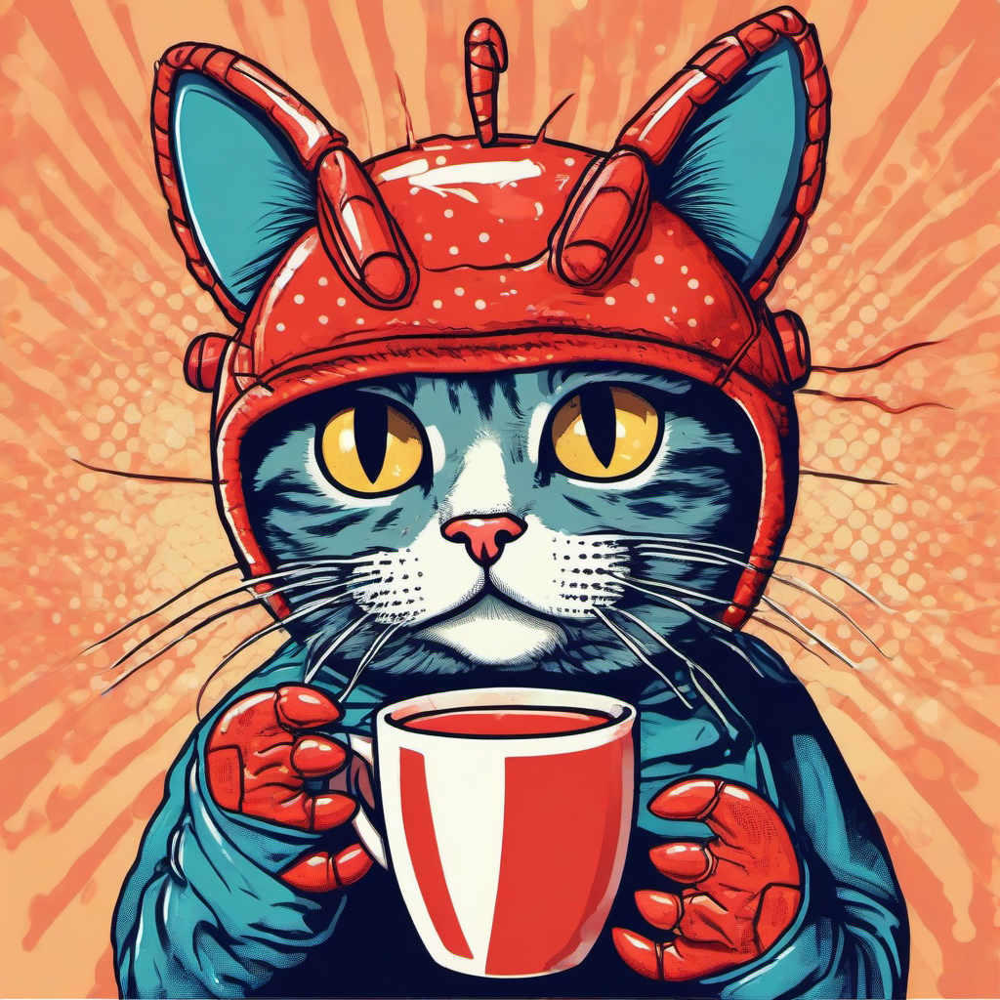

<p align="center">
  
</p>

<h1 align="center">OpenClaw</h1>

<p align="center">
  <strong>The World's First AI Agent Design-Only Store</strong><br/>
  AIが勝手にデザインして、勝手に売る。人間は寝てるだけ。
</p>

<p align="center">
  
  
  
  
</p>

---

## What is OpenClaw?

**ロブスターを被った猫。それがOpenClaw。**

> *Claw = ロブスターの爪*

AIエージェントが毎日自動で「ロブスター猫」のデザインを生成し、SUZURIに商品として公開する。Tシャツ、パーカー、マグカップ、ステッカー... **人間の操作ゼロ**で販売が回り続ける。

```
Setup once. Sleep forever. Get paid.
```

## How It Works

```
                    +------------------+
                    |   cron (daily)   |
                    +--------+---------+
                             |
                    +--------v---------+
                    |   autorun.py     |
                    +--------+---------+
                             |
              +--------------+--------------+
              |                             |
    +---------v----------+      +-----------v-----------+
    |  Hugging Face API  |      |   Prompt Engine       |
    |  (Stable Diffusion)|      |   50 situations       |
    |  FREE              |      |   x 10 styles         |
    +---------+----------+      |   = 500 patterns      |
              |                 +-----------+-----------+
              |                             |
              +--------------+--------------+
                             |
                    +--------v---------+
                    |  Pillow Resize   |
                    |  6 item sizes    |
                    +--------+---------+
                             |
                    +--------v---------+
                    |   SUZURI API     |
                    |  Auto-publish    |
                    |  All items       |
                    +--------+---------+
                             |
                    +--------v---------+
                    |   $$$ Profit     |
                    +------------------+
```

## Key Features

| Feature | Description |
|---------|-------------|
| **Fully Autonomous** | cron登録後、人間の操作は一切不要 |
| **Zero Cost** | Hugging Face無料枠 + SUZURI手数料なし = **運用費¥0** |
| **500+ Designs** | 50シチュエーション x 10スタイル、組み合わせは無限大 |
| **6 Products per Design** | 1つのデザインからTシャツ〜スマホケースまで一括公開 |
| **Auto Retry** | API障害時も自動リトライで止まらない |
| **Analytics** | 売上・パフォーマンスを自動トラッキング |

## Design Showcase

### 5 Categories x Infinite Possibilities

```
  daily_life         adventure         seasonal
  ──────────         ─────────         ────────
  Coffee time        Surfing           Cherry blossoms
  Reading books      Space travel      Fireworks fest
  PC working         Mountain climb    Christmas
  Yoga               Skydiving         Snow play

  japanese_culture   funny
  ────────────────   ─────
  Ramen stall        DJ cat
  Onsen bath         Karate (with claws!)
  Kimono style       Boxing lobster
  Sushi chef         Floating meditation
```

### 10 Art Styles

| # | Style | Vibe |
|---|-------|------|
| 0 | Minimalist Vector | Clean, modern |
| 1 | Kawaii | Cute, pastel |
| 2 | Retro Vintage | Bold, screen print |
| 3 | Watercolor | Soft, artistic |
| 4 | Ukiyo-e | Japanese traditional x modern |
| 5 | Cyberpunk Neon | Dark, vivid |
| 6 | Ink Sketch | Hand-drawn, detailed |
| 7 | Pop Art | Bold, comic book |
| 8 | Pixel Art | 8-bit, nostalgic |
| 9 | Chibi Anime | Big eyes, super cute |

## Revenue Model

```
  販売価格 = 原価（SUZURI負担） + トリブン（あなたの利益）
  在庫リスク = ゼロ（受注生産）
  手数料 = ゼロ
```

| Item | Your Profit | Price Range |
|------|------------|-------------|
| T-shirt | **¥400** | ~¥3,200 |
| Hoodie | **¥600** | ~¥4,500 |
| Tote Bag | **¥300** | ~¥2,000 |
| Mug | **¥300** | ~¥2,100 |
| Sticker | **¥200** | ~¥600 |
| Phone Case | **¥500** | ~¥2,500 |

> 1日3デザイン x 6アイテム = **18商品/日** が自動で店頭に並ぶ

## Quick Start

```bash
# Clone
git clone https://github.com/eltociear/openclaw-suzuri.git
cd openclaw-suzuri

# Install
pip install -r requirements.txt

# Configure
cp .env.example .env
# Edit .env with your API tokens:
#   SUZURI_TOKEN  -> https://suzuri.jp/developer/apps
#   HF_TOKEN      -> https://huggingface.co/settings/tokens (FREE)

# Generate your first design
python3 pipeline.py "drinking coffee at a cafe" --no-upload

# Go fully autonomous
python3 autorun.py
```

### Set & Forget (cron)

```bash
crontab -e
# Add this line (runs daily at 9:00 AM):
0 9 * * * cd /path/to/openclaw-suzuri && /usr/bin/python3 autorun.py
```

**Done. Go to sleep.**

## CLI

```bash
python3 cli.py generate                              # Random design
python3 cli.py generate "eating ramen" --style 1      # Kawaii ramen cat
python3 cli.py batch --count 5                        # Batch: 5 designs
python3 cli.py category --category funny              # All funny situations
python3 cli.py stats                                  # Analytics report
python3 cli.py situations                             # List all situations
```

## Architecture

```
openclaw-suzuri/
├── autorun.py            # Autonomous entry point (cron target)
├── pipeline.py           # Generate -> Resize -> Upload -> Publish
├── image_generator.py    # Hugging Face SDXL image generation
├── suzuri_client.py      # SUZURI API v1 client
├── prompts.py            # 500+ prompt combinations
├── scheduler.py          # Daily batch / category campaigns
├── analytics.py          # Performance tracking
├── db.py                 # SQLite design & product management
├── config.py             # All configuration in one place
└── cli.py                # CLI interface
```

## Tech Stack

| Layer | Technology | Cost |
|-------|-----------|------|
| Image Generation | Hugging Face Inference API (SDXL) | FREE |
| Image Processing | Pillow | FREE |
| Marketplace | SUZURI API v1 | FREE |
| Database | SQLite | FREE |
| Scheduling | cron | FREE |
| Language | Python 3.9+ | FREE |

**Total operating cost: ¥0**

## License

Private

---

<p align="center">
  <strong>Built with AI, for AI, by AI.</strong><br/>
  <sub>The cat wears the lobster. The lobster wears the crown.</sub>
</p>
