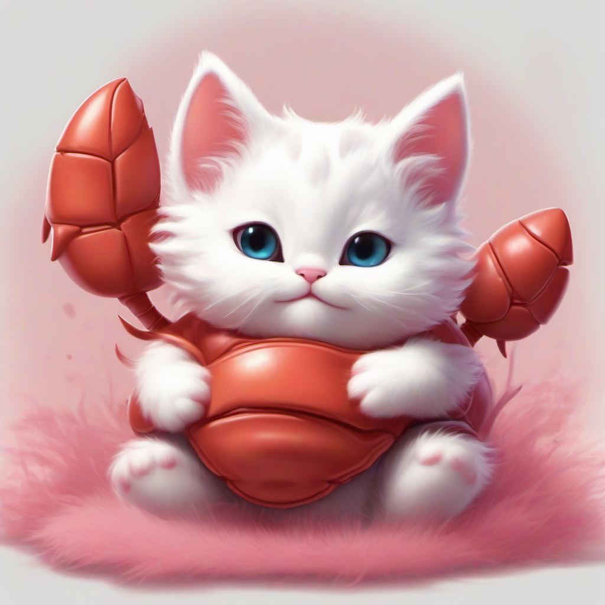
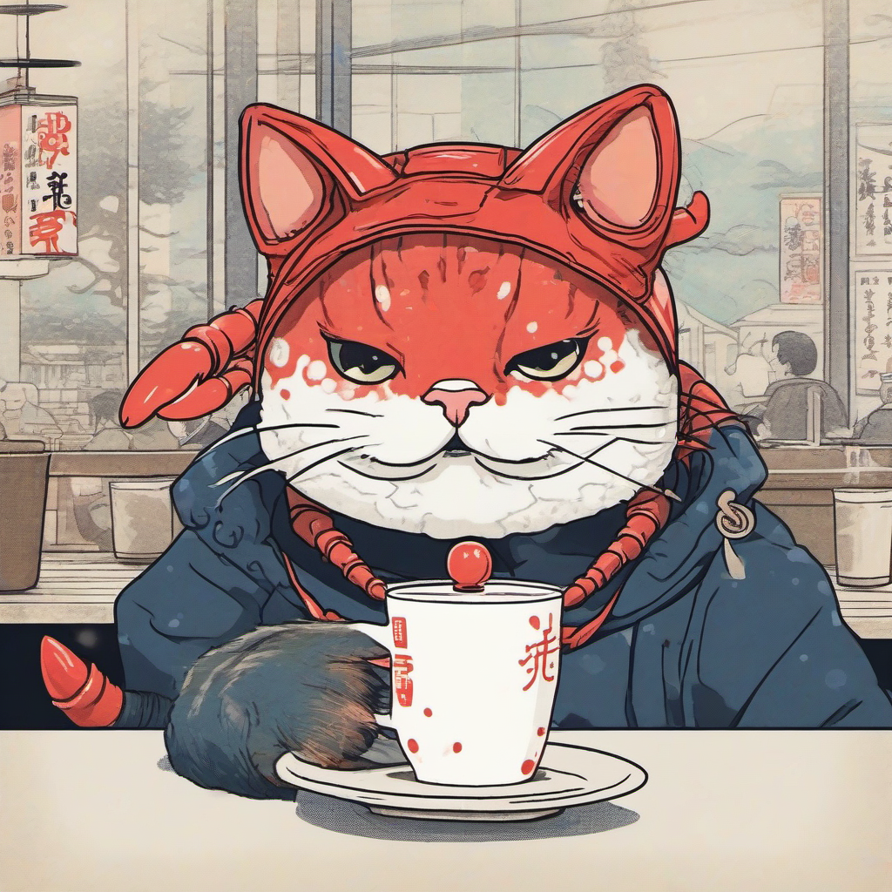
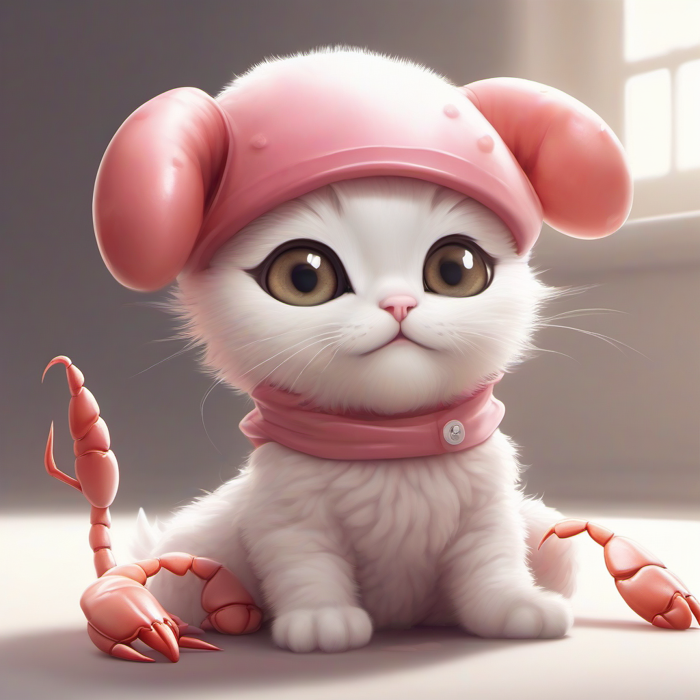
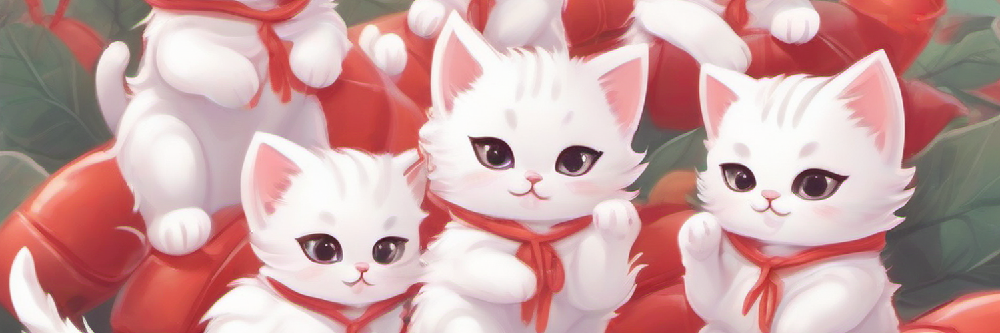

<p align="center">
  
</p>

<h1 align="center">ロブ活 - はさんでかせぐ -</h1>
<h3 align="center">Lob-hustle: Pinch & Earn</h3>

<p align="center">
  <strong>The World's First Fully Autonomous AI Agent Merchandise Store</strong><br/>
  AIが勝手にデザインして、勝手に売る。人間は寝てるだけ。
</p>

<p align="center">
  
  
  
  
  
  
</p>

<p align="center">
  <a href="https://suzuri.jp/masterteam">Shop</a> ・
  <a href="#quick-start">Quick Start</a> ・
  <a href="#line-integration">LINE Integration</a> ・
  <a href="#demo">Demo</a>
</p>

---

## The Pitch

> **「ラーメン食べてるデザイン作って」**
>
> LINEでそう送るだけで、AIエージェントが自動でデザインを生成し、
> Tシャツ・パーカー・マグカップ・ステッカー・トートバッグ・スマホケースの
> **6商品をSUZURIに即公開**。あなたは何もしなくていい。

```
Setup once. Sleep forever. Get paid.
```

---

## Demo

<p align="center">
  
  
  
  
</p>

<p align="center">
  <sub>All generated automatically. No human involved.</sub>
</p>

---

## What Makes This Different

| Traditional Merch | ロブ活 |
|-------------------|--------|
| デザイナーに依頼 ¥5,000〜 | AIが自動生成 **¥0** |
| 1デザイン → 1商品 | 1デザイン → **6商品** 同時公開 |
| 手動でアップロード | SUZURI APIで **全自動** |
| 在庫リスクあり | 受注生産 **リスクゼロ** |
| 月に数デザイン | 毎日18商品 **365日無休** |
| PCの前に座る必要 | LINEで指示 or **完全放置** |

---

## Architecture

```
┌─────────────────────────────────────────────────────────────┐
│                    YOU (or nobody)                           │
│              LINE / Telegram / Discord / ...                │
└──────────────────────┬──────────────────────────────────────┘
                       │ "ラーメンのデザイン作って"
                       v
┌──────────────────────────────────────────────────────────────┐
│                  OpenClaw Agent                              │
│  ┌──────────┐  ┌──────────┐  ┌──────────────────────────┐   │
│  │ SOUL.md  │  │ SKILL.md │  │ HEARTBEAT.md             │   │
│  │ 人格定義  │  │ スキル定義 │  │ 週1で自動デザイン生成    │   │
│  └──────────┘  └──────────┘  └──────────────────────────┘   │
└──────────────────────┬──────────────────────────────────────┘
                       │
         ┌─────────────┼─────────────┐
         v             v             v
  ┌────────────┐ ┌──────────┐ ┌───────────┐
  │ Prompt     │ │ HF API   │ │ SUZURI    │
  │ Engine     │ │ (SDXL)   │ │ API v1    │
  │            │ │          │ │           │
  │ 50 scenes  │ │ Generate │ │ Upload    │
  │ x 10 style │ │ image    │ │ 6 items   │
  │ = 500      │ │ FREE     │ │ Publish   │
  └────────────┘ └──────────┘ │ Set price │
                              └─────┬─────┘
                                    v
                            ┌──────────────┐
                            │  SUZURI Shop │
                            │  売れたら     │
                            │  自動で利益   │
                            └──────────────┘
```

---

## LINE Integration

OpenClawのLINE連携で、スマホからストアを完全操作。

| LINEメッセージ | 動作 |
|---------------|------|
| 「ラーメン食べてるデザイン作って」 | そのシチュエーションで生成 → 6商品公開 |
| 「5個まとめて作って」 | ランダム5デザイン一括生成 |
| 「面白い系で作って」 | funny カテゴリから生成 |
| 「今の売上どう？」 | ショップ統計レポート |
| 「どんなデザインが作れる？」 | 50シチュエーション一覧 |
| (何も送らなくても) | Heartbeatが週1で自動生成 |

---

## Revenue Model

```
  販売価格 = 原価（SUZURI負担） + トリブン（あなたの利益）
  在庫リスク = ゼロ（受注生産）
  手数料   = ゼロ
  運用費   = ゼロ
```

| Item | Your Profit | Price Range |
|------|------------|-------------|
| T-shirt | **¥400** | ~¥3,200 |
| Hoodie | **¥600** | ~¥4,500 |
| Tote Bag | **¥300** | ~¥2,000 |
| Mug | **¥300** | ~¥2,100 |
| Sticker | **¥200** | ~¥600 |
| Phone Case | **¥500** | ~¥2,500 |

### Simulation

| Period | Designs | Products | Potential Revenue (if 1% sells) |
|--------|---------|----------|-------------------------------|
| 1 month | 12 | 72 | ~¥280 |
| 6 months | 78 | 468 | ~¥1,800 |
| 1 year | 156 | 936 | ~¥3,600+ |

> 週1 x 3デザイン x 6アイテム = **18商品/週** が自動で店頭に並ぶ
> 商品数が増えるほど検索ヒット率が上がり、売上は加速度的に伸びる
> LINEからいつでも追加生成も可能

---

## Design Catalog

### 5 Categories x 50 Situations

```
  daily_life              adventure             seasonal
  ──────────              ─────────             ────────
  Coffee time             Surfing               Cherry blossoms
  Reading books           Space rocket          Fireworks fest
  PC working              Mountain peak         Christmas tree
  Chef cooking            Skateboarding         Halloween costume
  Selfie time             Camping               Snow play

  japanese_culture        funny
  ────────────────        ─────
  Ramen bowl              DJ turntables
  Onsen bath              Karate (with claws!)
  Kimono style            Boxing lobster
  Sushi conveyor          Superhero flying
  Takoyaki making         Gym workout
```

### 10 Expression Styles

Each situation is rendered with randomized expressions:

| Style | Expression |
|-------|-----------|
| Front facing | Innocent eyes, looking at viewer |
| Head tilt | Curious, one paw raised |
| Happy | Sparkling eyes, playful |
| Sleepy | Half-closed eyes, cozy |
| Surprised | Wide eyes, mouth open |
| Winking | Cheerful, one eye closed |
| Determined | Clenching claws, confident |
| Shy | Blushing, looking down |
| Excited | Both claws raised, celebrating |
| Peaceful | Eyes closed, serene smile |

---

## Quick Start

### Option A: GitHub Codespaces (Recommended)

1. Click **"Code" → "Codespaces" → "Create codespace on main"**
2. Set secrets in GitHub Settings → Codespaces → Secrets:
   - `SUZURI_TOKEN` from https://suzuri.jp/developer/apps
   - `HF_TOKEN` from https://huggingface.co/settings/tokens (FREE)
3. In the terminal:
```bash
python3 pipeline.py "eating ramen" --no-upload   # Test
python3 pipeline.py "eating ramen"                # Publish to SUZURI
```

### Option B: OpenClaw Agent (Fully Autonomous)

```bash
# Install OpenClaw
npm install -g openclaw
openclaw init

# Register this repo as a skill
cp -r . ~/.openclaw/skills/suzuri-designer/

# Configure heartbeat (auto-generate every 8 hours)
# Edit ~/.openclaw/openclaw.json — see HEARTBEAT.md

# Done. OpenClaw takes it from here.
```

### Option C: Local Python

```bash
git clone https://github.com/eltociear/openclaw-suzuri.git
cd openclaw-suzuri
pip install -r requirements.txt
cp .env.example .env    # Edit with your tokens
python3 autorun.py      # Generate 3 designs + publish
```

---

## CLI Reference

```bash
# Single design
python3 cli.py generate                              # Random
python3 cli.py generate "eating ramen" --style 1      # Specific

# Batch
python3 cli.py batch --count 5                        # 5 designs
python3 cli.py category --category funny              # By category

# Management
python3 cli.py stats                                  # Analytics
python3 cli.py situations                             # List scenes
python3 cli.py items                                  # SUZURI items
python3 cli.py upload image.png --title "My Design"   # Manual upload
```

---

## Project Structure

```
openclaw-suzuri/
│
├── SOUL.md               # OpenClaw agent personality
├── SKILL.md              # OpenClaw skill definition
├── HEARTBEAT.md          # Autonomous heartbeat checklist
│
├── pipeline.py           # Core: Generate -> Upload -> Publish
├── image_generator.py    # Hugging Face SDXL generation
├── suzuri_client.py      # SUZURI API v1 client
├── prompts.py            # 500+ prompt combinations
├── config.py             # Single source of truth for all settings
├── db.py                 # SQLite with indexes
│
├── autorun.py            # Standalone autonomous runner
├── scheduler.py          # Batch / campaign scheduler
├── analytics.py          # Performance tracking
├── cli.py                # CLI interface
│
├── scripts/              # OpenClaw skill entry points
│   ├── generate.py
│   ├── batch.py
│   ├── stats.py
│   └── situations.py
│
├── .devcontainer/        # GitHub Codespaces config
│   └── devcontainer.json
│
└── assets/               # Showcase images
```

---

## Tech Stack

| Layer | Technology | Cost |
|-------|-----------|------|
| AI Agent | OpenClaw Framework | FREE |
| Chat | LINE / Telegram / Discord | FREE |
| Image Gen | Hugging Face Inference API (SDXL) | FREE |
| Marketplace | SUZURI API v1 | FREE |
| Database | SQLite | FREE |
| Hosting | GitHub Codespaces | FREE (60h/month) |
| Language | Python 3.9+ | FREE |

```
Total operating cost: ¥0
```

---

## Built With

This entire project — code, designs, README, and debugging — was built by AI agents:

- **Claude Code** (Opus 4.6) — Architecture, implementation, code review, bug fixes
- **Stable Diffusion XL** — All design generation
- **OpenClaw** — Autonomous agent orchestration
- **SUZURI API** — Automated merchandise publishing

No designers were hired. No inventory was purchased. No humans were harmed.

---

<p align="center">
  
</p>

<p align="center">
  <strong>ロブ活 - はさんでかせぐ -</strong><br/>
  <sub>Setup once. Sleep forever. Get paid.</sub><br/><br/>
  <a href="https://suzuri.jp/masterteam">Visit the Shop</a>
</p>
